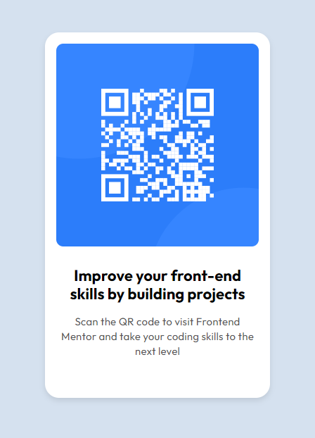

# Frontend Mentor - QR code component solution

This is a solution to the [QR code component challenge on Frontend Mentor](https://www.frontendmentor.io/challenges/qr-code-component-iux_sIO_H). Frontend Mentor challenges help you improve your coding skills by building realistic projects. 

## Table of contents

- [Overview](#overview)
  - [Screenshot](#screenshot)
  - [Links](#links)
- [Author](#author)

## Overview

### Screenshot

### Links

- Solution URL: [Frontebd Mentor](https://qr-code-component-main-eight.vercel.app/)
- Live Site URL: [Vercel](https://qr-code-component-main-eight.vercel.app/)

## Author

- Website - [Tatiana Pavlinova](https://github.com/Pavlinova)
- Frontend Mentor - [@Pavlinova](https://www.frontendmentor.io/profile/Pavlinova)

